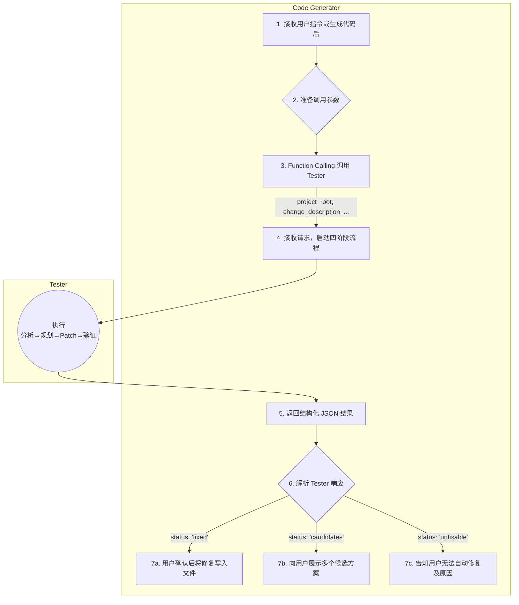
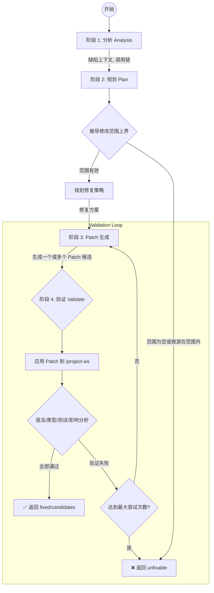

# Tester开发方案

**工程级、范围受限、容器化自动修复子 Agent**

---

## 目录

1. 概述
2. 核心能力
3. 与 Code Generator 的协作
4. 核心流程：四阶段自动修复
5. 容器与执行环境
6. 修改范围上界推导机制
7. 约定
   1. API参数（OpenAI Function Calling）
   2. 响应格式（JSON）
      - 成功修复（`status: "fixed"`）
      - 候选方案（`status: "candidates"`）
      - 无法修复（`status: "unfixable"`）
   3. 配置文件（`.tester/config.yaml`）
8. 优势总结

---

## 概述

调试器是一个专为 **Code Generator 调用** 设计的子 Agent，用于在真实工程项目中自动定位缺陷、生成安全修复方案并验证其正确性。它通过 **会话 ID 管理** 实现状态跟踪，借助 **AST 调用分析** 严格限定修改范围上界，并在 **语言定制的 Docker 容器** 中执行 **分析 → 规划 → Patch 生成 → 验证** 的四阶段流程。所有输出严格遵循 **OpenAI Function Calling JSON Schema**，不写入文件、不直连用户，仅返回结构化结果供 Code Generator 决策。

## 核心能力 

| 能力                          | 说明                                                                             |
|-----------------------------|--------------------------------------------------------------------------------|
| **会话 ID 管理**                | 每次请求分配唯一 `session_id`，用于日志、状态与容器复用                                             |
| **三重范围上界推导**                | **AST 调用图**（静态可达性） + **Agent 缺陷理解**（动态上下文） + **`allowed_paths`**（路径白名单） → 精准闭包 |
| **四阶段流程**                   | `分析 → 规划 → Patch → 验证`，阶段失败即终止                                                 |
| **容器化执行**                   | 每工程绑定长期容器，语言定制运行时，写时复制工作区                                                      |
| **主 Agent 协作**              | 接收 `change_description`，返回 JSON；由主 Agent 负责交互与写入                               |
| **OpenAI Function Calling** | 请求/响应严格符合 schema                                                               |

## 与 Code Generator 的协作

| 角色                 | 职责                                                                                                     |
|--------------------|--------------------------------------------------------------------------------------------------------|
| **Code Generator** | - 生成代码后或接收用户指令<br>- 调用 Tester（Function Calling）<br>- 解析返回结果<br>- 向用户展示候选方案<br>- 用户确认后写入文件              |
| **Tester**         | - 接收调用，分配 `session_id`<br>- 执行四阶段流程<br>- 返回 JSON（fixed / candidates / unfixable）<br>- **永不写文件、永不直连用户** |

> **协议**：Tester 是 Code Generator 的“可信验证与修复引擎”。



## 核心流程：四阶段（Analysis → Plan → Patch → Validate）

### 阶段 1：分析（Analysis）
- 输入：`test_cases` / `functionality` / `error_log`
- 动作：
    - 在 `/project-ws` 中运行测试或解析错误
    - 定位初始缺陷点（文件 + 函数/行号）
    - 构建项目级 AST 调用图
- 输出：缺陷上下文 + 调用链

### 阶段 2：规划（Plan）
- 动作：
    - 修改范围上界推导
    - 修复方案规划
- 若范围为空或根源在范围外 → 返回 `unfixable`
- 输出：`repairable_scope: string[]`

### 阶段 3：Patch 生成（Patch）
- 动作：
    - 根据修复方案生成补丁
    - 仅在 `repairable_scope` 内生成一个或多个 Patch 候选
    - 每个 Patch 为标准 unified diff
- 输出：`patch_set[]` 或 `candidates[]`

### 阶段 4：验证（Validate）
- 动作：
    - 应用 Patch 到 `/project-ws`
    - 执行：
        - 语法检查（如 `python -m py_compile`）
        - 类型检查（如 `mypy`，若启用）
        - 所有 `test_cases`或自动推导测试
    - 影响分析：仅检查范围内的调用者兼容性
    - 不成功则调整修复方案，根据配置决定是否重试 Patch 生成
- 输出：`validation_summary`
- 无论成功与否，保存修复日志与状态供审计

> 验证不通过则再次尝试 Patch 生成，直至达到最大尝试次数，仍失败则返回 `unfixable`。



## 容器与执行环境

### 容器生命周期

- **绑定粒度**：每个 `project_root` 路径绑定一个专属容器。
- **创建时机**：首次调试请求时按语言自动选择镜像创建，支持自动推断或配置指定运行时。
- **持久化标识**：容器 ID 与会话元数据存于 `project_root/.tester/`。
- **复用策略**：后续请求复用同一容器，避免重复初始化。

### 写时复制（Copy-on-Write）工作区

| 宿主机路径                             | 容器路径          | 权限     | 用途        |
|-----------------------------------|---------------|--------|-----------|
| `project_root`                    | `/project-ro` | **只读** | 原始源码，永不修改 |
| `project_root/.tester/workspace/` | `/project-ws` | **可写** | 修复验证工作区   |

- `/project-ro`：源码只读挂载，防止误改。
- `/project-ws`：CoW 机制创建的轻量副本，所有修改仅在此生效，通过OverlayFS覆盖`/project-ro`，达到修改源文件的效果。

## 修改范围上界推导机制

为避免漏掉关键修复文件，范围上界由以下三者交联合成：
1. AST 调用图：静态分析函数/方法调用关系，构建缺陷点的**可达代码单元集合**
2. Agent 缺陷理解：动态解析源代码、输入的测试用例与错误日志，补充**隐式依赖或测试桩文件**
3. allowed_paths：从配置中读取路径白名单，裁剪前两者结果

> **最终范围上界 = (AST 可达 ∪ Agent 推断) ∩ allowed_paths**  
> 此闭包一经确定，**所有修复（含递归）必须严格限制其中**。

## 约定

### API参数（OpenAI Function Calling）

| 字段名                     | 类型              | 必填 | 说明                                     |
|-------------------------|-----------------|:--:|----------------------------------------|
| **project_root**        | `string`        | ✅  | 项目根目录绝对路径（如 `/workspace/my-app`）       |
| **task_id**             | `string`        | ✅  | 本次任务id，用于从数据库获取本任务的相关信息（任务描述、方法定义、依赖项） |
| **test_cases**          | `array<object>` | ❌  | 显式测试用例（输入/输出对）                         |
| &nbsp;&nbsp;├─ `input`  | `array`         | -  | 测试输入参数                                 |
| &nbsp;&nbsp;└─ `output` | `any`           | -  | 期望输出                                   |
| **entry_point**         | `string`        | ❌  | 入口文件路径（自动推断优先）                         |
| **language**            | `string`        | ❌  | 编程语言及版本（自动检测优先）                        |
| **prompt_hint**         | `string`        | ❌  | 允许人类提供的修复策略提示（如“保持向后兼容”）               |
| **human_in_the_loop**   | `boolean`       | ❌  | 是否返回候选方案供主 Agent 决策，默认 `true`          |
| **conversation_id**     | `string`        | ❌  | 对话 ID，用于上下文管理                          |                                    |

**约束条件**：
- `project_root` 必填；
- `test_cases` 不填则由本Agent自动根据描述信息推断测试用例；

### 响应格式（JSON）

#### 成功修复（`status: "fixed"`）

```json
{
  "session_id": "dbg_20251108_a1b2c3",
  "status": "fixed",
  "repairable_scope": ["src/core/math.py", "src/api/v1.py"],
  "fixed_files": {
    "src/core/math.py": "def divide(a, b):\n    if b == 0: return None\n    return a / b"
  },
  "patch_set": [
    {
      "file": "src/core/math.py",
      "patch": "@@ -1,3 +1,4 @@\n def divide(a, b):\n-    return a / b\n+    if b == 0: return None\n+    return a / b"
    }
  ],
  "validation_summary": {
    "syntax_check": "passed",
    "type_check": "passed",
    "tests_passed": 3,
    "tests_total": 3,
    "impact_analysis": "compatible within repairable scope"
  }
}
```

#### 候选方案（`status: "candidates"`）

```json
{
  "session_id": "dbg_20251108_x9y8z7",
  "status": "candidates",
  "repairable_scope": ["src/utils.py"],
  "candidates": [
    {
      "id": "fix-null",
      "description": "Return None on division by zero",
      "risk": "low",
      "files": { "src/utils.py": "..." },
      "patch_set": [ ... ]
    }
  ],
  "diagnosis": "Missing zero check in safe_div"
}
```

#### 无法修复（`status: "unfixable"`）

```json
{
  "session_id": "dbg_20251108_err404",
  "status": "unfixable",
  "repairable_scope": ["src/"],
  "diagnosis": "Root cause in vendor/lib/external.py (outside allowed_paths)",
  "suggested_action": "Provide mock in test or exclude from validation"
}
```


### 配置文件（`.tester/config.yaml`）

```yaml
# 容器运行时
container:
  runtime: "auto"  # e.g., "python-3.12"

# 修复范围
recursive_fix:
  enabled: true
  allowed_paths: ["src/", "lib/"]
  denied_paths: ["legacy/", "vendor/", "secrets/"]

# 验证策略
validation:
  run_type_check: true
  impact_analysis_scope: "in_range_only"
  timeout: 60
  max_patch_attempts: 3

# 安全
safety:
  allow_new_imports: false
  enable_impact_analysis: true
```

## 优势总结

| 维度       | 能力                         | 价值                 |
|----------|----------------------------|--------------------|
| **可追踪**  | 会话 ID 全链路追踪                | 调试过程可审计、可复现        |
| **精准修复** | AST + 路径白名单限定范围            | 不越权、不污染、不误改        |
| **工程可信** | 原生工具链 + 容器环境               | 修复即生产可用            |
| **高效复用** | 工程绑定容器 + 依赖缓存              | 首次完整，后续极速          |
| **标准集成** | OpenAI Function Calling 兼容 | 无缝嵌入 LLM Agent 工作流 |

**Tester 是 Code Agent 自动化闭环中的“安全修复执行器”** —— 有边界、可验证、可审计、可集成。

与 Copilot / Cursor 等工具相比，它具备工程级自动修复的能力，强调**范围受限**与**验证闭环**，确保每次修复都在可控范围内进行，并通过测试与影响分析保障代码质量与稳定性。