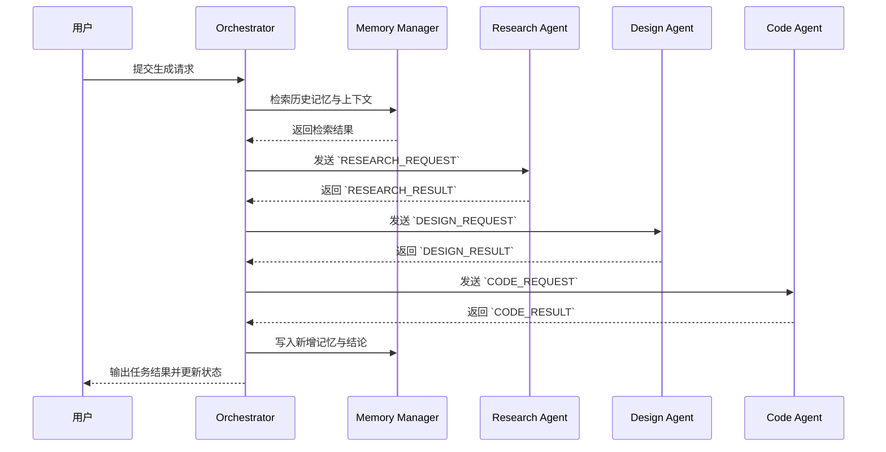
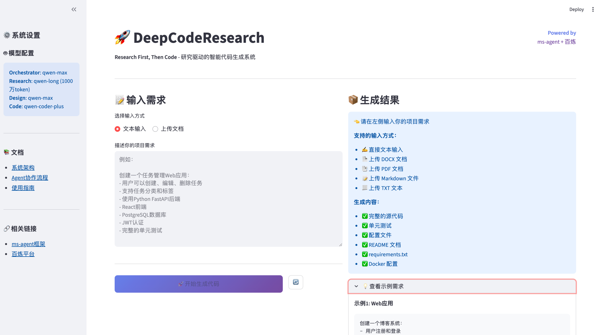

# DeepCodeResearch 技术架构文档

## 1. 系统概述

DeepCodeResearch 是一个基于 **Research First** 理念的智能代码生成系统，通过多Agent协作完成从需求分析到代码生成的完整流程，生成 repo-level 级别的代码仓库。

### 1.1 核心特性

- **多Agent协作**: 四个专业化Agent分工协作
- **深度研究驱动**: 研究阶段深入分析需求和技术栈
- **超长上下文**: qwen-long支持1000万token上下文
- **Repo级别生成**: 生成完整的代码仓库结构
- **多格式输入**: 支持DOCX、PDF、Markdown、文本输入
- **实时可视化**: Streamlit界面实时展示生成过程

### 1.2 技术栈

| 组件 | 技术选型 | 说明 |
|------|---------|------|
| **Agent框架** | ModelScope ms-agent | 多Agent协作框架 |
| **模型服务** | 阿里云百炼平台 | 提供通义千问系列模型 |
| **工具协议** | MCP (Model Context Protocol) | 标准化工具接口 |
| **前端** | Streamlit | 快速构建Web界面 |
| **后端** | Python 3.8+ | 核心业务逻辑 |

---

## 2. 系统架构

### 2.1 整体架构


### 2.2 数据流

```
用户输入 → 文档解析 → 需求理解 → 深度研究 → 架构设计 → 代码生成 → 质量检查 → 输出仓库
```

### 2.3 整体流程图


---

## 3. Preprocessor设计

### 3.1 定位与职责

- 将原始输入（文本、文档、图片、表格等）解析为结构化片段  
- 抽取章节、元数据、关键实体，构建统一上下文表示  
- 生成图片、表格等多模态素材的文字描述或嵌入  
- 触发多模态 RAG 检索流水线，补充可检索的向量知识  
- 输出供 Orchestrator 与各下游 Agent 复用的标准化上下文

### 3.2 多模态解析流程

1. **格式识别**：基于文件头与元数据判断输入类型（DOCX / PDF / Markdown / 纯文本 / 图片等）  
2. **内容分段**：按章节、标题、段落拆分，提取关键注释、代码块  
3. **实体抽取**：识别需求要点、技术关键词、约束条件等关键信息  
4. **多模态处理**：对图片、表格执行 OCR / caption / embedding，生成文本描述与向量表示  
5. **上下文封装**：组合文本与多模态信息，形成结构化上下文对象并写入短期记忆

### 3.3 RAG 检索流水线

1. **稀疏检索**：基于关键词召回 Top 100 候选片段，确保覆盖率  
2. **语义检索**：通过 Milvus / Weaviate 等向量库召回 Top 50 语义相关片段  
3. **重排序**：调用 qwen-max 模型对候选结果进行重排序，输出 Top 10 高置信度证据  
4. **知识写入**：将最终证据与嵌入写入 Knowledge Base，供后续 Agent 检索复用

### 3.4 输入输出

- **输入**：用户原始输入、多模态素材、历史知识检索意图  
- **输出**：结构化上下文、多模态嵌入、RAG 检索结果、知识库更新指令

**工作流程**:


---


## 4. Memory Manager 设计

Memory Manager 贯穿全流程，为各 Agent 提供统一的上下文管理与知识沉淀能力：

- **短期记忆**：维护当前任务的上下文，以滑动窗口（最近 10k tokens）保证高频交互中的即时可用信息。
- **长期记忆**：沉淀历史任务成果、知识库条目及关键代码片段，统一存储于 Weaviate 向量数据库中，便于跨项目复用。
- **记忆检索**：结合 BM25 稀疏检索与语义相似度向量检索，保证覆盖率与精确度的平衡，Orchestrator 可根据任务动态拼接检索结果。
- **记忆更新**：每完成一个子任务，自动将产出结论、风险提示与可复用经验写入长期记忆，形成持续演进的知识体系。

---

## 5. Agent 详细设计

### 5.1 Orchestrator Agent（Planner + Executor + Memory）

**主要任务**

解析用户需求、按照极限编程**快速迭代、不断演进**等原则，规划生成任务，协调下游 Research/Design/Code Agent 的执行，并维护整体任务状态与记忆。

**角色拆分**

- **Planner（决策层）**  
  - 解析用户需求并生成 TodoList  
  - 调用 Memory 召回历史经验、约束与最佳实践  
  - 根据任务优先级调度 Executor 执行  
  - 维护任务状态、风险与回滚策略（长期记忆主体）

- **Executor（执行层）**  
  - 获取 Planner 分配的细化任务与上下文  
  - 在短期记忆中缓存执行过程的日志、输出与错误  
  - 将执行结果与后续建议返回 Planner，任务完成后实例释放

- **Memory（记忆层）**  
  - 短期记忆：会话上下文、最新子任务状态、异常反馈  
  - 长期记忆：需求解析、历史决策、仓库元数据存储于向量库 / 数据库  
  - 提供检索与写入接口，支持 Planner 在任务前后同步知识

**模型**: qwen-max（Planner）、qwen-coder-plus 等（Executor，根据任务动态选择）

**工作流程**:


**输入**: 用户需求（文本 / 文档 / 多模态附件） + 历史记忆检索结果

**输出**: 执行计划描述，并调度各个模块执行任务


**多模态解析 + RAG 执行职责**: Orchestrator 通过 Preprocessor 将原始输入解析为结构化片段与向量嵌入；Planner 根据任务上下文构造检索意图，访问多模态知识库完成证据召回；检索结果与历史记忆共同驱动后续 Agent 调度，并在任务结束后写回新的嵌入与结论，形成闭环。

**关键特性**:
- 分层决策体系
- TodoList 长期维护与复用
- 记忆召回与持续沉淀
- 异常处理与循环调度
- 多模态解析与 RAG 检索闭环

### 5.2 Research Agent（Planner + Executor + Memory）

**角色拆分**

- **Planner（研究策划）**  
  - 解析 Orchestrator 提供的结构化需求上下文，划分研究主题与分析切面  
  - 结合 Memory 检索历史调研结论、领域约束  
  - 生成调研 TodoList，安排并行/串行的分析任务  
  - 汇总各 Executor 的产出，维护需求与风险清单

- **Executor（研究执行）**  
  - 按任务颗粒执行内容解析、深度分析、外部搜索（**Web Search**）等工作  
  - 在短期记忆中缓存当前章节摘要、待解问题、参考链接  
  - 使用LLM对抓取的信息进行内容质量评分:
    1. 相关性评分（0-1）：内容与查询的匹配度
    2. 权威性评分（0-1）：来源可信度
    3. 时效性评分（0-1）：内容新鲜度
    4. 使用 SimHash 进行近重复检测  
    5. 按综合评分降序排列  （综合评分 = 0.5 * 相关性 + 0.3 * 权威性 + 0.2 * 时效性）
    6. 保留 Top-K 结果（K 由用户需求决定）

  - 产出结构化片段,将搜索结果存入Memory Manager：  


- **Memory（研究记忆）**  
  - 短期记忆：当前会话的章节索引、问题列表、临时发现  
  - 长期记忆：领域知识、历史调研结论、技术栈决策存入向量库 / 知识库  
  - 组织 Orchestrator 提供的 RAG 证据与参考链接，辅助 Planner 做证据引用与一致性检查  
  - 支持 Planner 在任务前后做检索与写入，实现持续积累

**模型**: qwen-long（Planner/Executor 根据任务动态分配）

**输入**: 结构化需求上下文（Orchestrator 提供） + 历史调研记忆检索结果

**输出**:
```json
{
  "requirements": [...],
  "tech_stack": {...},
  "constraints": [...],
  "risk_list": [...],
  "memory_updates": ["new_requirement", "risk_note"]
}
```

**工作流程**


**关键特性**:
- 超长上下文理解
- 跨段落推理
- 隐含需求挖掘
- 矛盾检测
- 基于结构化上下文的深度洞察

### 5.3 Design Agent（Planner + Executor + Memory）

**角色拆分**

- **Planner（架构策划）**  
  - 接收研究报告，制定架构设计 TodoList  
  - 调用 Memory 检索历史架构模式、约束与案例  
  - 分配模块划分、接口定义、技术选型等任务给 Executor  
  - 汇总设计成果，输出统一的架构蓝图与目录结构

- **Executor（架构执行）**  
  - 针对 Planner 下发的任务进行架构模式评估、分层设计、接口与数据模型细化  
  - 在短期记忆中维护当前迭代的草案、反馈与依赖图  
  - 输出结构化描述（模块说明、接口契约、目录草案）回传 Planner

- **Memory（架构记忆）**  
  - 短期记忆：当前会话的设计决策表、未决问题、迭代版本  
  - 长期记忆：历史架构方案、通用组件库、约束条件存入向量库 / 配置库  
  - 支持 Planner 在设计前检索最佳实践，并在交付后沉淀经验

**模型**: qwen-max（Planner）、qwen-max / qwen-coder-plus（Executor 视任务而定）

**输入**: Research Agent 的研究报告 + 历史架构记忆检索结果

**输出**:
```json
{
  "architecture": {...},
  "modules": [...],
  "directory_structure": {...},
  "data_models": [...],
  "api_spec": {...},
  "memory_updates": ["new_module_pattern", "constraint_adjustment"]
}
```

**工作流程**


**关键特性**:
- 分层决策与执行
- 架构知识持续沉淀
- 模块化与可扩展性
- 设计与实现联动

### 5.4 Code Agent（Planner + Executor + Memory）

**角色拆分**

- **Planner（代码策划）**  
  - 根据设计蓝图拆解代码生成 TodoList（模块、测试、配置、文档）  
  - 调用 Memory 获取历史模块模板、常用脚手架、质量基线  
  - 为每个 Todo 指派合适的 Executor，并监控执行状态

- **Executor（代码执行）**  
  - 负责具体的代码生成、单测编写、静态分析、调试修复等任务，并自动触发测试-诊断-修复闭环  
  - 在短期记忆中缓存当前生成的代码片段、日志与修复线索  
  - 完成任务后返回产物与质量报告，随后实例释放

- **Memory（代码记忆）**  
  - 长期记忆：代码模板库、最佳实践、历史缺陷与修复方案、仓库变更历史  
  - 短期记忆：当前迭代的任务状态、运行日志、问题列表  
  - 支持 Planner 在任务前检索素材，执行中追加进度，执行后沉淀经验

**模型**: qwen-max（Planner）、qwen-coder-plus / qwen-long（Executor，根据任务而定）

**输入**: Design Agent 的设计文档 + 历史代码记忆检索结果

**输出**:
```json
{
  "repo_structure": {...},
  "statistics": {...},
  "quality_report": {...},
  "memory_updates": ["new_pattern_snippet", "test_gap_note"]
}
```

**关键特性**:
- Planner/Executor 分层协作
- 模板与最佳实践可复用
- **自动化测试 + 自愈修复闭环**
- Repo 级代码交付

**工作流程**


**核心功能**:
1. 基于设计生成代码
2. 生成单元测试并自动执行
3. 代码静态分析
4. 自动调试和修复（失败重试 ≤3 次）
5. 生成配置文件
6. 生成文档
7. 组织代码仓库

**生成顺序**:
1. 基础设施层（配置、工具）
2. 数据模型层（ORM、Schema）
3. 业务逻辑层（Services、Utils）
4. 接口层（Routes、Controllers）
5. 测试代码（单元测试、集成测试）
6. 项目文档（README、API文档）

**质量检查流程**:
1. 静态分析：检测语法错误、类型错误、依赖缺失
2. 统一格式：自动格式化代码，确保风格一致
3. 自动修复：对静态分析发现的问题进行自我修复
4. 单元测试：执行覆盖关键路径的测试套件并收集日志
5. 测试失败分析：定位失败原因并尝试修复，最多迭代 3 次
6. 人类接入：仍未通过时触发 Human-in-the-loop 介入

> **自动化保障要点**  
> Code Agent 在每个子任务内都遵循“**生成 → 自动测试 → 智能修复**”的循环，确保产出的代码在交付前已经过足够的自验证，将人工审核集中在疑难场景。

**Deployment Agent 概述**

专职承接 Code Agent 的合格产出，按照其提供的“部署教程”与 `deploy/` 目录脚本，自动化完成多环境发布与交付。

**核心职责**:
- **读取部署教程**：解析 Code Agent 输出中的部署指引（如 `deployment_guide.md`、管道配置）并构建执行计划。
- **环境校验**：检查目标环境凭证、依赖与资源配额，确保与教程约定一致。
- **流水线编排**：调用 Jenkins、GitHub Actions 或内部 Deployment Agent，执行容器构建、镜像推送与灰度发布。
- **监控与回滚**：实时采集部署日志与健康指标，必要时按教程中的策略自动回滚，并将结果写回 Memory。

**输入**：来自 Code Agent 的 `repo_structure`、`deployment_guide`、质量报告等产物。

**输出**：部署结果状态、访问入口、监控链接以及需要沉淀的经验记忆条目。

**工作流程**

---

## 6. 扩展性设计

### 6.1 新增Agent

- **脚手架命令**：提供 `deepcoder agent create <name>` CLI，一次性生成 Planner / Executor / Memory 三层模板（含依赖注入、日志、度量埋点）。  
- **声明式配置**：新增 `agents/<name>/agent.yaml`，声明模型、权限、可用工具、钩子绑定等信息；修改后支持热重载。  
- **自动注册**：CLI 会更新 `orchestrator/registry.json`，并触发一致性校验，保证新 Agent 立即被workflow识别。  
- **单元测试模板**：同步生成 `tests/agents/test_<name>.py`，涵盖常规输入、异常分支与记忆读写用例。  
- **快速校验**：提供 `deepcoder agent doctor <name>` 命令，自动执行静态检查、依赖验证与模拟对话，以确保上线前的稳定性。

### 6.2 新增MCP工具

- **Manifest 驱动**：采用与 Cursor 同款的 `mcp.json` 作为工具清单，描述服务端点、认证方式、超时时间及可见范围。  
- **热加载机制**：修改 `mcp.json` 后，通过控制面触发热重载即可完成新增/删减，无需重启核心进程。  
- **多环境隔离**：支持为 dev / staging / prod 维护独立的 `mcp.json`，由配置中心下发并版本化管理。  
- **样例**:

```json
{
  "mcpServers": {
    "AliyunBailianMCP_WebSearch": {
      "type": "sse",
      "url": "https://dashscope.aliyuncs.com/api/v1/mcps/WebSearch/sse",
      "headers": {
        "Authorization": "Bearer ${API_KEY}"
      }
    },
    "github": {
      "type": "streamable_http",
      "url": "https://mcp.api-inference.modelscope.net/6e335422beb741/mcp"
    }
  }
}
```

### 6.3 支持新的输入格式

```python
class DocumentParser:
    @staticmethod
    def parse_excel(file_path):
        # 解析Excel
        pass
```

---

### 6.4 动态插件机制

支持动态加载新组件，无需修改核心代码：

- **Tool Plugins**：新工具的热插拔
- **Memory Plugins**：支持向量数据库、图数据库等多种存储后端
- **LLM Wrappers**：支持多种LLM后端（OpenAI、Anthropic、本地模型等）
- **Agent Plugins**：自定义Agent角色的快速集成

---

### 6.5 生命周期钩子

系统提供完整的生命周期钩子体系，支持在关键节点注入**自定义逻辑**；详细机制见 `## 6. 钩子系统`。

---

### 6.6 自动部署管线

- **统一配置**：`deploy/` 目录集中维护多环境部署模板（dev/staging/prod）及参数化配置，支持快速复制与差异化调整。
- **Agent 协作**：Orchestrator 在 Code Agent 完成自动测试与自愈循环后，调用 Deployment Agent 或 CI/CD 服务（如 Jenkins、GitHub Actions）触发发布。
- **安全控制**：部署前执行凭证校验、镜像签名验证与变更审计；关键环境可开启多因素审批与时间窗限制。
- **回滚策略**：支持蓝绿 / 金丝雀发布，失败时自动回滚到上一稳定版本，并将异常信息写入 Memory，供后续分析。
- **可观察性**：部署日志、指标与告警统一接入监控平台，为自动调优与自愈策略提供数据输入。

---

## 7. 钩子系统

### 7.1 钩子覆盖范围

- **pre-execution**：任务执行前的预处理，例如输入校验、依赖资源准备、上下文补全。  
- **post-execution**：任务完成后的后处理，可执行结果归档、指标采集、告警通知。  
- **tool-invocation**：工具调用时的拦截与增强，注入熔断、降级、缓存或速率控制策略。  
- **error-handling**：异常收敛与自愈，支持重试、回滚、降级和人工干预触发。  
- **agent-communication**：Agent 间通信的监控与过滤，保障消息协议一致性与安全性。

### 7.2 触发流程

1. **注册阶段**：扩展组件通过插件机制声明钩子类型、触发时机与优先级。  
2. **调度阶段**：Orchestrator 按当前上下文动态装配钩子链，支持串行或并行执行模式。  
3. **执行阶段**：钩子共享标准化上下文（请求、状态、指标等），在各自阶段执行定制逻辑。  
4. **回传阶段**：钩子可返回变更指令或中断信号，Orchestrator 根据策略合并结果并决定后续流程。

### 7.3 安全与审计

- 钩子需声明权限范围与可访问资源，结合 RBAC 做精细化控制。  
- 关键钩子启用白名单、速率限制与幂等校验，防止误配置带来风险。  
- 全量执行日志写入审计通道，包含触发参数、耗时、返回结果与异常栈。  
- 对涉及敏感操作的钩子支持多因素确认与超时回收机制。

### 7.4 扩展示例

- **质量保障**：`post-execution` 钩子触发静态分析或单测运行，自动生成质量报告。  
- **多模态调优**：`tool-invocation` 钩子对多模态检索结果进行重排序、标签增强。  
- **安全合规**：`agent-communication` 钩子执行敏感信息脱敏与合规校验。  
- **应急响应**：`error-handling` 钩子联动 SLA 监控，触发自动扩容或人工介入。

---

## 8. MCP 工具层

### 8.1 OpenAPI 工具自动生成与安全控制

- **优先选用 ModelScope MCP 广场**：默认先从 ModelScope MCP 广场检索并接入官方托管的 mcp server，以复用经过认证的服务能力；若需自建，才落地本地 OpenAPI 解析流程。

- **自动解析与建模**：内置 OpenAPI Schema 解析器，能够根据外部服务的 OpenAPI 规范自动生成 MCP 工具定义、入参/出参校验逻辑以及错误处理模板，实现“即插即用”的接口能力扩展。  
- **动态注册**：解析结果会被转化为标准化的工具元数据，注入 Orchestrator 的工具注册中心，实现多 Agent 对新工具的即时发现与调用。  
- **认证授权管理**：支持 API Key、OAuth2、JWT 等主流认证模式，在工具层统一管理凭证生命周期、续签与吊销，并提供多租户隔离策略。  
- **安全策略与审计**：调用前进行权限校验与速率限制，调用后记录详细日志并输出可审计轨迹，确保外部 API 访问的安全可控。  
- **异常防护**：对返回结果执行模式校验、危险指令过滤与重试策略，防止外部接口异常波及核心流程。

---

### 8.2 工具接口

MCP (Model Context Protocol) 提供标准化的工具接口：

```python
class MCPTools:
    def web_search(query: str) -> Dict
    def code_analysis(code: str) -> Dict
    def execute_code(code: str) -> Dict
    def read_document(path: str) -> Dict
```

### 8.3 工具详情

#### 8.3.1 Web Search Tool

**功能**: 实时网络搜索

**使用场景**:
- 查询最新技术栈信息
- 搜索最佳实践
- 查找解决方案
- 获取框架文档

**输入**:
```json
{
  "query": "FastAPI authentication best practices 2025"
}
```

**输出**:
```json
{
  "results": [
    {
      "title": "FastAPI Security",
      "url": "https://...",
      "snippet": "...",
      "relevance": 0.95
    }
  ]
}
```

#### 8.3.2 Code Analysis Tool

**功能**: 静态代码分析

**使用场景**:
- 语法检查
- 类型检查
- 代码风格检查
- 复杂度分析
- 安全漏洞检测

**输入**:
```json
{
  "code": "def function(): ...",
  "language": "python"
}
```

**输出**:
```json
{
  "issues": [
    {
      "type": "type_error",
      "line": 10,
      "message": "Missing type annotation",
      "severity": "warning"
    }
  ],
  "metrics": {
    "complexity": 5,
    "maintainability": 85
  }
}
```

#### 8.3.3 Code Execution Tool

**功能**: 沙箱代码执行

**使用场景**:
- 运行单元测试
- 验证代码正确性
- 调试问题

**安全措施**:
- 沙箱环境隔离
- 资源限制
- 超时控制

---

### 8.4 MCP Server 调用示例

下列示例展示了 Orchestrator Executor 通过 MCP SDK 连接官方 `web_search` server，并调用工具后写回结果。示例默认使用 ModelScope 发布的标准 HTTP server，其他协议（如 gRPC）只需替换 transport 层配置。

```python
from mcp.client import MCPClient
from mcp.schema import ToolInvokeRequest

MCP_ENDPOINT = "https://mcp.modelscope.cn/web_search"
API_KEY = os.getenv("WEB_SEARCH_TOKEN")


def run_web_search(query: str) -> dict:
    client = MCPClient(
        base_url=MCP_ENDPOINT,
        headers={"Authorization": f"Bearer {API_KEY}"},
        timeout=5.0,
    )

    request = ToolInvokeRequest(
        tool_name="web_search",
        params={"query": query},
        trace_id=f"orch-{uuid.uuid4()}",
    )

    response = client.invoke_tool(request)
    response.raise_for_status()

    payload = response.json()
    # 将检索结果写入 Memory，供后续 Agent 共享
    memory_manager.write(
        namespace="research",
        key=query,
        value={
            "results": payload["results"],
            "source": "mcp.web_search",
        },
    )
    return payload
```

> **注意**  
> - `MCPClient` 也支持 `with` 上下文写法，以确保连接在异常时被正确关闭。  
> - 若 server 通过 WebSocket 提供流式输出，可改用 `client.stream_tool(...)` 并结合异步处理。  
> - 调用前后务必记录调用日志，并结合钩子系统实现熔断、重试与指标采集。

---

## 9. 通信协议

### 9.1 A2A消息格式

Agent间使用标准化的消息格式通信：

```python
@dataclass
class AgentMessage:
    msg_type: MessageType      # 消息类型
    sender: str                 # 发送方
    receiver: str               # 接收方
    content: Dict[str, Any]     # 消息内容
    metadata: Optional[Dict]    # 元数据
```

### 9.2 消息类型

```python
class MessageType(Enum):
    TASK_ASSIGNMENT = "task_assignment"
    RESEARCH_REQUEST = "research_request"
    RESEARCH_RESULT = "research_result"
    DESIGN_REQUEST = "design_request"
    DESIGN_RESULT = "design_result"
    CODE_REQUEST = "code_request"
    CODE_RESULT = "code_result"
    HUMAN_REVIEW = "human_review"
```

### 9.3 通信流程


---

## 10. 前端设计

### 10.1 界面布局

仅展示**demo**



### 10.2 核心功能

1. **多格式输入**
   - 文本输入框
   - DOCX上传
   - PDF上传
   - Markdown上传
   - TXT上传

2. **实时状态展示**
   - Agent工作状态指示
   - 进度条显示
   - 日志输出

3. **代码预览**
   - 文件树导航
   - 代码语法高亮
   - 多文件Tab切换

4. **下载功能**
   - 一键下载ZIP
   - 单个文件下载

---

## 11. 数据流设计

### 11.1 完整数据流

```
用户输入
    ↓
文档解析 (DocumentParser)
    ↓
多模态嵌入 & RAG 检索 (Multimodal RAG)
    ↓
Orchestrator (任务规划)
    ↓
Research Agent (深度研究)
    ├── 需求分析
    ├── Web搜索
    └── 研究报告
    ↓
Design Agent (架构设计)
    ├── 模块设计
    ├── 接口设计
    └── 设计文档
    ↓
Code Agent (代码生成)
    ├── 代码生成
    ├── 质量检查
    ├── 自动修复
    └── 代码仓库
    ↓
Human Review (可选)
    ↓
最终输出 (ZIP下载)
```

### 11.2 状态管理

使用Streamlit的session_state管理状态：

```python
st.session_state = {
    'messages': [],              # 消息历史
    'generated_repo': {},        # 生成的代码
    'agent_status': {},          # Agent状态
    'current_phase': None        # 当前阶段
}
```

---

## 12. 使用教程

详细部署脚本与环境配置示例已整理至 `demo/` 目录，覆盖本地开发、Docker 化部署以及生产环境的推荐参数，可按需在该目录中查看并复用，详见 `demo/README.md`。

---

## 13. 性能优化

### 13.1 缓存策略

1. **文档解析缓存**: 相同文档不重复解析
2. **LLM响应缓存**: 相似请求复用结果
3. **Web搜索缓存**: 缓存搜索结果

### 13.2 并发处理

1. 异步IO处理文档解析
2. 批量处理多个文件
3. 并行执行独立的MCP工具调用

### 13.3 流式输出

```python
for chunk in agent.call_llm(messages, stream=True):
    st.write(chunk)
```

实时展示LLM生成过程，提升用户体验。

---

## 14. 安全考虑

### 14.1 输入验证

- 文件大小限制（<50MB）
- 文件类型白名单
- 内容安全检查

### 14.2 代码执行安全

- 沙箱环境隔离
- 资源限制（CPU、内存、时间）
- 危险操作拦截

### 14.3 API安全

- API Key加密存储
- 请求频率限制
- 错误信息脱敏

---

## 15. 监控与日志

### 15.1 日志记录

```python
logging.info(f"[{agent_name}] Processing request")
logging.error(f"[{agent_name}] Error: {error}")
```

### 15.2 性能监控

- API调用延迟
- Token消耗统计
- 生成成功率
- 用户满意度

---

## 16. 测试策略

### 16.1 单元测试

- 测试各个Agent的独立功能
- 测试MCP工具接口
- 测试文档解析器

### 16.2 集成测试

- 测试完整的生成流程
- 测试Agent间通信
- 测试异常处理

### 16.3 端到端测试

- 模拟真实用户场景
- 验证生成的代码质量
- 性能压力测试

---

## 17. 参考文献

- ReAct: Synergizing Reasoning and Acting in Language Models [`https://arxiv.org/abs/2210.03629`](https://arxiv.org/abs/2210.03629)
- Reflexion: Language Agents with Verbal Reinforcement Learning [`https://arxiv.org/abs/2303.11366`](https://arxiv.org/abs/2303.11366)
- AdaPlanner: Adaptive Planning from Feedback with Language Models（支持动态规划、执行与反思循环的框架）[`https://arxiv.org/abs/2305.16653`](https://arxiv.org/abs/2305.16653)

---

**文档版本**: v1.0.1  
**最后更新**: 2025-11-10
